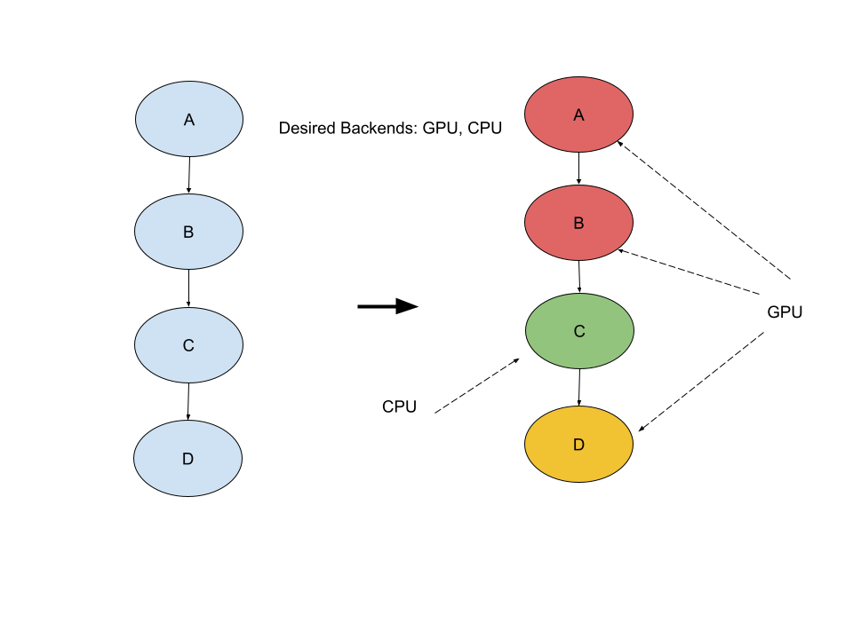
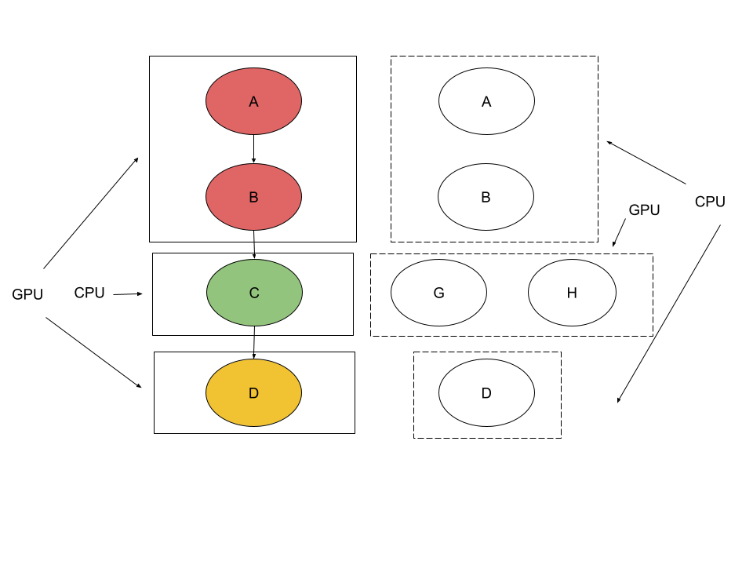
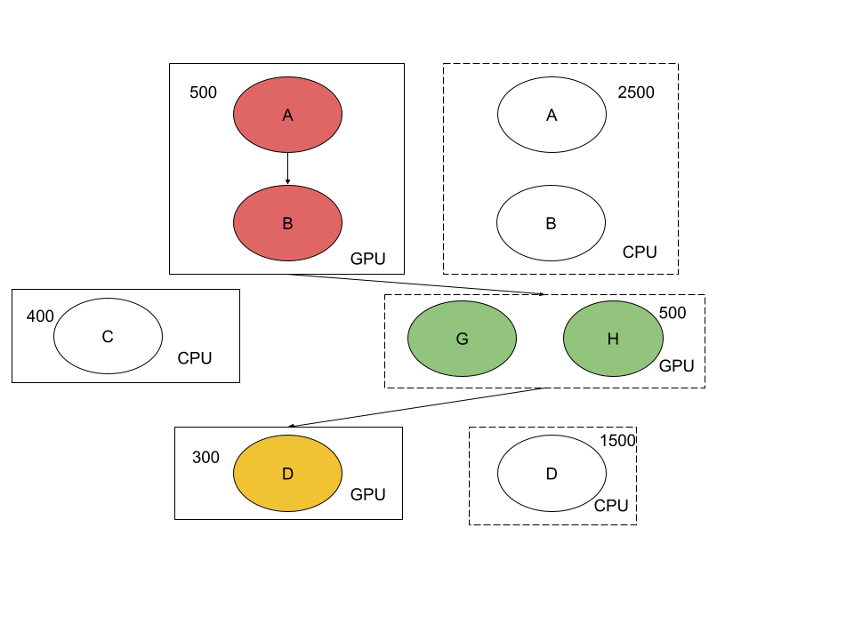
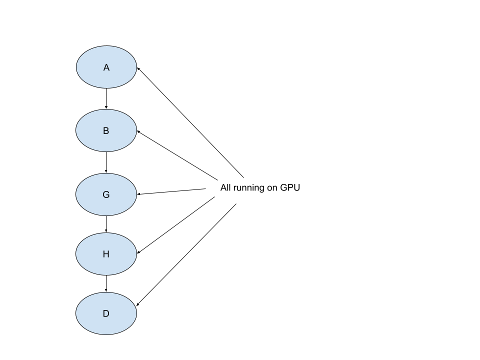

# Target Aware Conversion (TAC)

Different hardwares have different capabilities and restrictions.

TAC is designed to leverage hardwares' capabilities to:

*   Perform device-specific optimizations (such as unsupported ops lowering,
    layout transformations, etc.)
*   Graph partitioning based on the hardware costs modeling.
*   It supports general import/export where you can hook your own
    importer/exporter from any format to MLIR and export MLIR to anything.

For more details, please checkout the
[TAC workflow](https://github.com/tensorflow/tensorflow/tree/master/tensorflow/compiler/mlir/lite/experimental/tac/README.md#tac-workflow)
section

## How to use

Once you have a converted TfLite model ready, you can use the following command
to use TAC to optimize for your model:

```
bazel run -c opt //tensorflow/compiler/mlir/lite/experimental/tac:tac-translate -- <PATH_TO_YOUR_MODEL> -o=<OUTPUT_PATH> -device-specs=<HARDWARE_BACKENDS>
```

The devices_specs is a list of the names of the desired hardware backends,
separated by comma, e.g., "GPU,CPU".

If you're interested in what are the subgraphs being explored for different
backends, you can pass in `-output-mlir -inline-subgraphs=false` and check out
the output mlir file.

## How to add a hardware backend

If you want to add a hardware backend for TAC, you can start with the
`SimpleHardware` interface.

For example:

```
class FooHardware : public SimpleHardware {
 public:
  static constexpr char kId[] = "FOO";

  mlir::RewritePatternSet GetTransformations(
      MLIRContext* context) const override {
    mlir::RewritePatternSet patterns;
    // Pick the transformations that we want to perform,
    // We can add other transformations we like here.
    patterns.add<LowerPackIntoConcatReshape, UnrollSplit, UnrollSplitV,
                  PadSlice>(context);
    return patterns;
  }

  mlir::TypeID GetTypeId() const override {
    return mlir::TypeID::get<FooHardware>();
  }

  // We can specify what ops are not supported here.
  bool IsNotSupportedOp(mlir::Operation* op) const override { return false; }

  // This is basically saying how fast are we comparing to CPU.
  // The larger the value the better.
  float AdvantageOverCPU() const override { return 5.0; }
};
```

Then we need to register our hardware like below:

```
std::unique_ptr<TargetHardware> CreateFooHardware() {
  return std::make_unique<FooHardware>();
}

TargetHardwareRegistration<FooHardware> foo_hardware(
    "Target device for FOO", CreateFooHardware);
```

### Advanced user

For advanced users (e.g., you may already have your own hardware dialect
defined), please just use `TargetHardware` directly. See the following code
snippet for reference.

```
class MyCustomHardware : public TargetHardware {
 public:
  static constexpr char kId[] = "MY_CUSTOM_HARDWARE";

  mlir::TypeID GetTypeId() const override {
    return mlir::TypeID::get<MyCustomHardware>();
  }
  
  bool IsOpSupported(mlir::Operation* op) const override {
    // check whether the op is supported, if the user has they own dialect,
    // this can be target dialect legalization process.
  }
  
 double GetHardwareSwitchingCost(const TargetHardware* from,
                                 size_t buffer_size) const override {
    // Get the hardware switching cost from the source hardware.
 }

  double GetOpCost(mlir::Operation* op) const override {
    // call customized cost model.
  }
  
  mlir::RewritePatternSet GetTransformations(
      MLIRContext* context) const override {
    // customized transformations patterns: ops lowering/fusion, layout
    // transformation, etc.
  }
};
```

## TAC workflow

The workflow of target-aware-conversion is as followed:

1 Try to break down the whole graph into several subgraphs based on hardwares'
capabilities. See the diagram below, let's say our desired target backends are
"GPU" and "CPU", and currently "C" is not supported on "GPU", but the rest are
supported by "GPU". So we will end up with 3 subgraphs as shown in the diagram.



2  Perform ops-lowering & target-specific optimizations for
    different hardware backends. As shown in the below diagram, the red & the
    yellow subgraph will be duplicated as "alternative subgraph view" for "CPU".
    "C" op can be lowered into "G" + "H" op which can be supported by "GPU".
    


3  Estimate the costs for each subgraph (and their alternative views)
    based on the hardware cost model. See the following diagram.
    


4 Pick the proper subgraphs from the alternative views for execution based on
costs(computation costs, transfer costs, quant/dequant costs). As shown in the
diagram below, since cross-device data transferring cost is high, even "G" + "H"
running on GPU maybe less efficient than "C" running on "CPU", we will still
pick "G" + "H" subgraph.



The final graph looks like below:



## TAC components

### Hardwares

Hardwares are used to modeling target device capabilities & also ops cost for
the target devices.

We have already modeled `cpu_hardware` & `gpu_hardware` as well as the
`nnapi_hardware`.

### Passes

#### Target Annotation Pass
In this pass, every op will be targeted with the user specified targets based on
the device capabilities. For example, If the user specified the desired targets
are "GPU", "CPU", `conv2d` can run on both "GPU" and "CPU", we will annotate
the op `conv2d` with "GPU" since it's preferred; `pack` can only run on "CPU",
so we will annotate the op with "CPU" since "GPU" does not support this op.

#### Raise Target Subgraphs Pass

In this pass, ops will be broken down into subgraph. Those ops have the same
target annotation will be raised as subgraphs.

In this pass, subgraph is actually implemented with `FuncOp`.

Take the following code as an example:

```
func @simpleTest(%arg0: tensor<1xf32>, %arg1: tensor<1xf32>, %arg2: tensor<1xf32>, %arg3: tensor<1xf32>) -> tensor<2x1xf32> {
  %0 = "tfl.add"(%arg0, %arg1) {tac.device = "GPU", fused_activation_function = "RELU6", tac.inference_type = "FLOAT"} : (tensor<1xf32>, tensor<1xf32>) -> tensor<1xf32>
  %1 = "tfl.mul"(%0, %arg2) {tac.device = "GPU", fused_activation_function = "RELU6", tac.inference_type = "FLOAT"} : (tensor<1xf32>, tensor<1xf32>) -> tensor<1xf32>
  %2 = "tfl.add"(%arg0, %arg3) {tac.device = "GPU", fused_activation_function = "RELU6", tac.inference_type = "FLOAT"} : (tensor<1xf32>, tensor<1xf32>) -> tensor<1xf32>
  %3 = "tfl.pack"(%1, %2) {tac.device = "CPU", tac.inference_type = "FLOAT", axis = 0 : i32, values_count = 2 : i32} : (tensor<1xf32>, tensor<1xf32>) -> tensor<2x1xf32>
  return %3 : tensor<2x1xf32>
}
```

In this code, `%3` is annotated with "CPU", while others are annotated with
"GPU", in this case, `%3` will be raised as a separate function like below:

```
 func private @func_1_GPU_FLOAT(%arg0: tensor<1xf32>, %arg1: tensor<1xf32>) -> tensor<1xf32> attributes {tac.device = "GPU", tac.inference_type = "FLOAT", tac.interface_name = "func_1"} {
    %0 = tfl.add %arg0, %arg1 {fused_activation_function = "RELU6", tac.device = "GPU", tac.inference_type = "FLOAT"} : tensor<1xf32>
    return %0 : tensor<1xf32>
  }
```

And the rest ops will be raised as below:

```
 func private @func_2_CPU_FLOAT(%arg0: tensor<1xf32>, %arg1: tensor<1xf32>) -> tensor<2x1xf32> attributes {tac.device = "CPU", tac.inference_type = "FLOAT", tac.interface_name = "func_2"} {
    %0 = "tfl.pack"(%arg0, %arg1) {axis = 0 : i32, tac.device = "CPU", tac.inference_type = "FLOAT", values_count = 2 : i32} : (tensor<1xf32>, tensor<1xf32>) -> tensor<2x1xf32>
    return %0 : tensor<2x1xf32>
  }

func private @func_0_GPU_FLOAT(%arg0: tensor<1xf32>, %arg1: tensor<1xf32>, %arg2: tensor<1xf32>) -> tensor<1xf32> attributes {tac.device = "GPU", tac.inference_type = "FLOAT", tac.interface_name = "func_0"} {
    %0 = tfl.add %arg0, %arg1 {fused_activation_function = "RELU6", tac.device = "GPU", tac.inference_type = "FLOAT"} : tensor<1xf32>
    %1 = tfl.mul %0, %arg2 {fused_activation_function = "RELU6", tac.device = "GPU", tac.inference_type = "FLOAT"} : tensor<1xf32>
    return %1 : tensor<1xf32>
  }
```

And the original function will be replaced by `CallOps` to those `FuncOps`:

```
func @simpleTest(%arg0: tensor<1xf32>, %arg1: tensor<1xf32>, %arg2: tensor<1xf32>, %arg3: tensor<1xf32>) -> tensor<2x1xf32> {
    %0 = call @func_0_GPU_FLOAT(%arg0, %arg1, %arg2) {tac.device = "GPU", tac.inference_type = "FLOAT", tac.interface_name = "func_0"} : (tensor<1xf32>, tensor<1xf32>, tensor<1xf32>) -> tensor<1xf32>
    %1 = call @func_1_GPU_FLOAT(%arg0, %arg3) {tac.device = "GPU", tac.inference_type = "FLOAT", tac.interface_name = "func_1"} : (tensor<1xf32>, tensor<1xf32>) -> tensor<1xf32>
    %2 = call @func_2_CPU_FLOAT(%0, %1) {tac.device = "CPU", tac.inference_type = "FLOAT", tac.interface_name = "func_2"} : (tensor<1xf32>, tensor<1xf32>) -> tensor<2x1xf32>
    return %2 : tensor<2x1xf32>
  }
```

Why we need to raise those ops into `FuncOps`? Please see the following section.

#### Get Alternative Subgraph View Pass
In the Get Alternative Subgraph View Pass, we will essentially duplicate those
`FuncOps` and perform unsupported ops lowering & target-specific optimization.

For example, `Pack` is not supported by "GPU", but it can be lowered into
`Concat` + `Reshape` which can be supported by "GPU".

So the original example:

```
 func private @func_1_GPU_FLOAT(%arg0: tensor<1xf32>, %arg1: tensor<1xf32>) -> tensor<1xf32> attributes {tac.device = "GPU", tac.inference_type = "FLOAT", tac.interface_name = "func_1"} {
    %0 = tfl.add %arg0, %arg1 {fused_activation_function = "RELU6", tac.device = "GPU", tac.inference_type = "FLOAT"} : tensor<1xf32>
    return %0 : tensor<1xf32>
  }
```

Will be transformed into:

```
 func private @func_2_CPU_FLOAT(%arg0: tensor<1xf32>, %arg1: tensor<1xf32>) -> tensor<2x1xf32> attributes {tac.device = "CPU", tac.inference_type = "FLOAT", tac.interface_name = "func_2"} {
    %0 = "tfl.pack"(%arg0, %arg1) {axis = 0 : i32, tac.device = "CPU", tac.inference_type = "FLOAT", values_count = 2 : i32} : (tensor<1xf32>, tensor<1xf32>) -> tensor<2x1xf32>
    return %0 : tensor<2x1xf32>
  }

func private @func_2_GPU_FLOAT(%arg0: tensor<1xf32>, %arg1: tensor<1xf32>) -> tensor<2x1xf32> attributes {tac.device = "GPU", tac.inference_type = "FLOAT", tac.interface_name = "func_2"} {
    %cst = arith.constant dense<1> : tensor<4xi32>
    %cst_0 = arith.constant dense<2> : tensor<1xi32>
    %cst_1 = arith.constant dense<[2, 1]> : tensor<2xi32>
    %0 = "tfl.reshape"(%arg0, %cst) {tac.device = "GPU", tac.inference_type = "FLOAT"} : (tensor<1xf32>, tensor<4xi32>) -> tensor<1x1x1x1xf32>
    %1 = "tfl.reshape"(%arg1, %cst) {tac.device = "GPU", tac.inference_type = "FLOAT"} : (tensor<1xf32>, tensor<4xi32>) -> tensor<1x1x1x1xf32>
    %2 = "tfl.concatenation"(%0, %1) {axis = 3 : i32, fused_activation_function = "NONE", tac.device = "GPU", tac.inference_type = "FLOAT"} : (tensor<1x1x1x1xf32>, tensor<1x1x1x1xf32>) -> tensor<1x1x1x2xf32>
    %3 = "tfl.reshape"(%2, %cst_0) {tac.device = "GPU", tac.inference_type = "FLOAT"} : (tensor<1x1x1x2xf32>, tensor<1xi32>) -> tensor<2xf32>
    %4 = "tfl.reshape"(%3, %cst_1) {tac.device = "GPU", tac.inference_type = "FLOAT"} : (tensor<2xf32>, tensor<2xi32>) -> tensor<2x1xf32>
    return %4 : tensor<2x1xf32>
  }
```

#### Compute Costs Pass
In the compute cost pass, we will essentially compute the cost of each op within
the `FuncOp` based on the target-device cost model and sum them together.


#### Pick Subgraphs Pass
In the pick subgraphs pass, we will pick those subgraphs which can minimize the
global costs (we will take the tensor transferring costs as well).
