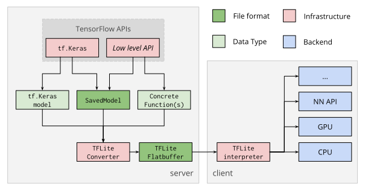

# TensorFlow Lite converter

The TensorFlow Lite converter takes a TensorFlow model and generates a
TensorFlow Lite [`FlatBuffer`](https://google.github.io/flatbuffers/) file
(`.tflite`). The converter supports
[SavedModel directories](https://www.tensorflow.org/guide/saved_model),
[`tf.keras` models](https://www.tensorflow.org/guide/keras/overview), and
[concrete functions](https://tensorflow.org/guide/concrete_function).

Note: This page contains documentation on the converter API for TensorFlow 2.0.
The API for TensorFlow 1.X is available
[here](https://github.com/tensorflow/tensorflow/blob/master/tensorflow/lite/g3doc/r1/convert/index.md).

## New in TF 2.2

TensorFlow Lite has switched to use a new converter backend by default - in the
nightly builds and TF 2.2 stable. Why we did we switch?

*   Enables conversion of new classes of models, including Mask R-CNN, Mobile
    BERT, and many more
*   Adds support for functional control flow (enabled by default in TensorFlow
    2.x)
*   Tracks original TensorFlow node name and Python code, and exposes them
    during conversion if errors occur
*   Leverages MLIR, Google's cutting edge compiler technology for ML, which
    makes it easier to extend to accommodate feature requests
*   Adds basic support for models with input tensors containing unknown
    dimensions
*   Supports all existing converter functionality

In case you encounter any issues:

*   Please create a
    [GitHub issue](https://github.com/tensorflow/tensorflow/issues/new?template=60-tflite-converter-issue.md)
    with the component label “TFLiteConverter.” Please include:
    *   Command used to run the converter or code if you’re using the Python API
    *   The output from the converter invocation
    *   The input model to the converter
    *   If the conversion is successful, but the generated model is wrong, state
        what is wrong:
        *   Producing wrong results and / or decrease in accuracy
        *   Producing correct results, but the model is slower than expected
            (model generated from old converter)
*   If you are using the allow_custom_ops feature, please read the
    [Python API](https://github.com/tensorflow/tensorflow/blob/master/tensorflow/lite/g3doc/convert/python_api.md)
    and
    [Command Line Tool](https://github.com/tensorflow/tensorflow/blob/master/tensorflow/lite/g3doc/convert/cmdline.md)
    documentation
*   Switch to the old converter by setting `--experimental_new_converter=false`
    (from the [tflite_convert](https://www.tensorflow.org/lite/convert/cmdline)
    command line tool) or `converter.experimental_new_converter=False` (from the
    [Python API](https://www.tensorflow.org/api_docs/python/tf/lite/TFLiteConverter))
*   If you want to convert a Frozen Graph you can use the `from_frozen_graph()` method from `tf.compat.v1.lite.TFLiteConverter.from_frozen_graph()`. One advantage of using it is it allows us to specify `input_arrays` and `output_arrays` that would go into the converted TensorFlow Lite model.   

## Device deployment

The TensorFlow Lite `FlatBuffer` file is then deployed to a client device (e.g.
mobile, embedded) and run locally using the TensorFlow Lite interpreter. This
conversion process is shown in the diagram below:

## Converting models

The TensorFlow Lite converter should be used from the
[Python API](python_api.md). Using the Python API makes it easier to convert
models as part of a model development pipeline and helps mitigate
[compatibility](../guide/ops_compatibility.md) issues early on. Alternatively,
the [command line tool](cmdline.md) supports basic models.
