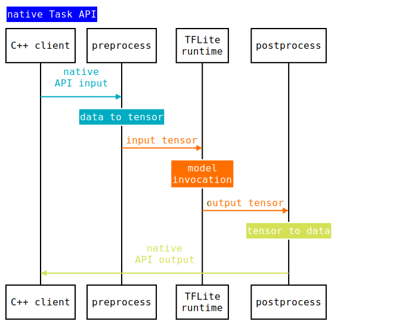
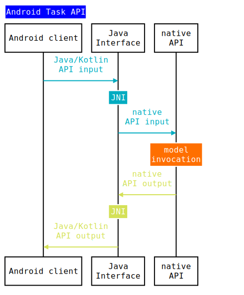
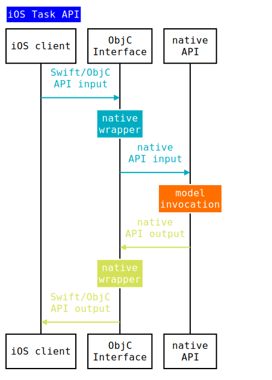

# Build you own Task API

<a href="overview.md">TensorFlow Lite Task Library</a> provides prebuilt
native/Android/iOS APIs on top of the same infrastructure that abstracts
TensorFlow. You can extend the Task API infrastructure to build customized APIs
if your model is not supported by existing Task libraries.

## Overview

Task API infrastructure has a two-layer structure: the bottom C++ layer
encapsulating the native TFLite runtime and the top Java/ObjC layer that
communicates with the C++ layer through JNI or native wrapper.

Implementing all the TensorFlow logic in only C++ minimizes cost, maximizes
inference performance and simplifies the overall workflow across platforms.

To create a Task class, extend the
[BaseTaskApi](https://github.com/tensorflow/tflite-support/blob/master/tensorflow_lite_support/cc/task/core/base_task_api.h)
to provide conversion logic between TFLite model interface and Task API
interface, then use the Java/ObjC utilities to create corresponding APIs. With
all TensorFlow details hidden, you can deploy the TFLite model in your apps
without any machine learning knowledge.

TensorFlow Lite provides some prebuilt APIs for most popular
<a href="overview.md#supported_tasks">Vision and NLP tasks</a>. You can build
your own APIs for other tasks using the Task API infrastructure.

<div align="center">
<div align="center">Figure 1. prebuilt Task APIs
<div align="left">

## Build your own API with Task API infra

### C++ API

All TFLite details are implemented in the native API. Create an API object by
using one of the factory functions and get model results by calling functions
defined in the interface.

#### Sample usage

Here is an example using the C++
[`BertQuestionAnswerer`](https://github.com/tensorflow/tflite-support/blob/master/tensorflow_lite_support/cc/task/text/qa/bert_question_answerer.h)
for
[MobileBert](https://tfhub.dev/tensorflow/lite-model/mobilebert/1/default/1).

```cpp
  char kBertModelPath[] = "path/to/model.tflite";
  // Create the API from a model file
  std::unique_ptr<BertQuestionAnswerer> question_answerer =
      BertQuestionAnswerer::CreateFromFile(kBertModelPath);

  char kContext[] = ...; // context of a question to be answered
  char kQuestion[] = ...; // question to be answered
  // ask a question
  std::vector<QaAnswer> answers = question_answerer.Answer(kContext, kQuestion);
  // answers[0].text is the best answer
```

#### Building the API

<div align="center">
<div align="center">Figure 2. Native Task API
<div align="left">

To build an API object,you must provide the following information by extending
[`BaseTaskApi`](https://github.com/tensorflow/tflite-support/blob/master/tensorflow_lite_support/cc/task/core/base_task_api.h)

*   __Determine the API I/O__ - Your API should expose similar input/output
    across different platforms. e.g `BertQuestionAnswerer` takes two strings
    `(std::string& context, std::string& question)` as input and outputs a
    vector of possible answer and probabilities as `std::vector<QaAnswer>`. This
    is done by specifying the corresponding types in `BaseTaskApi`'s
    [template parameter](https://github.com/tensorflow/tflite-support/blob/master/tensorflow_lite_support/cc/task/core/base_task_api.h?q="template <class OutputType, class... InputTypes>").
    With the template parameters specified, the
    [`BaseTaskApi::Infer`](https://github.com/tensorflow/tflite-support/blob/master/tensorflow_lite_support/cc/task/core/base_task_api.h?q="Infer\(InputTypes... args\)")
    function will have the correct input/output types. This function can be
    directly called by API clients, but it is a good practice to wrap it inside
    a model-specific function, in this case, `BertQuestionAnswerer::Answer`.

    ```cpp
    class BertQuestionAnswerer : public BaseTaskApi<
                                  std::vector<QaAnswer>, // OutputType
                                  const std::string&, const std::string& // InputTypes
                                  > {
      // Model specific function delegating calls to BaseTaskApi::Infer
      std::vector<QaAnswer> Answer(const std::string& context, const std::string& question) {
        return Infer(context, question).value();
      }
    }
    ```

*   __Provide conversion logic between API I/O and input/output tensor of the
    model__ - With input and output types specified, the subclasses also need to
    implement the typed functions
    [`BaseTaskApi::Preprocess`](https://github.com/tensorflow/tflite-support/blob/5cea306040c40b06d6e0ed4e5baf6c307db7bd00/tensorflow_lite_support/cc/task/core/base_task_api.h#L74)
    and
    [`BaseTaskApi::Postprocess`](https://github.com/tensorflow/tflite-support/blob/5cea306040c40b06d6e0ed4e5baf6c307db7bd00/tensorflow_lite_support/cc/task/core/base_task_api.h#L80).
    The two functions provide
    [inputs](https://github.com/tensorflow/tensorflow/blob/1b84e5af78f85b8d3c4687b7dee65b78113f81cc/tensorflow/lite/schema/schema.fbs#L1007)
    and
    [outputs](https://github.com/tensorflow/tensorflow/blob/1b84e5af78f85b8d3c4687b7dee65b78113f81cc/tensorflow/lite/schema/schema.fbs#L1008)
    from the TFLite `FlatBuffer`. The subclass is responsible for assigning
    values from the API I/O to I/O tensors. See the complete implementation
    example in
    [`BertQuestionAnswerer`](https://github.com/tensorflow/tflite-support/blob/master/tensorflow_lite_support/cc/task/text/qa/bert_question_answerer.cc).

    ```cpp
    class BertQuestionAnswerer : public BaseTaskApi<
                                  std::vector<QaAnswer>, // OutputType
                                  const std::string&, const std::string& // InputTypes
                                  > {
      // Convert API input into tensors
      absl::Status BertQuestionAnswerer::Preprocess(
        const std::vector<TfLiteTensor*>& input_tensors, // input tensors of the model
        const std::string& context, const std::string& query // InputType of the API
      ) {
        // Perform tokenization on input strings
        ...
        // Populate IDs, Masks and SegmentIDs to corresponding input tensors
        PopulateTensor(input_ids, input_tensors[0]);
        PopulateTensor(input_mask, input_tensors[1]);
        PopulateTensor(segment_ids, input_tensors[2]);
        return absl::OkStatus();
      }

      // Convert output tensors into API output
      StatusOr<std::vector<QaAnswer>> // OutputType
      BertQuestionAnswerer::Postprocess(
        const std::vector<const TfLiteTensor*>& output_tensors, // output tensors of the model
      ) {
        // Get start/end logits of prediction result from output tensors
        std::vector<float> end_logits;
        std::vector<float> start_logits;
        // output_tensors[0]: end_logits FLOAT[1, 384]
        PopulateVector(output_tensors[0], &end_logits);
        // output_tensors[1]: start_logits FLOAT[1, 384]
        PopulateVector(output_tensors[1], &start_logits);
        ...
        std::vector<QaAnswer::Pos> orig_results;
        // Look up the indices from vocabulary file and build results
        ...
        return orig_results;
      }
    }
    ```

*   __Create factory functions of the API__ - A model file and a
    [`OpResolver`](https://github.com/tensorflow/tensorflow/blob/master/tensorflow/lite/core/api/op_resolver.h)
    are needed to initialize the
    [`tflite::Interpreter`](https://github.com/tensorflow/tensorflow/blob/master/tensorflow/lite/interpreter.h).
    [`TaskAPIFactory`](https://github.com/tensorflow/tflite-support/blob/master/tensorflow_lite_support/cc/task/core/task_api_factory.h)
    provides utility functions to create BaseTaskApi instances.

    Note: By default
    [`TaskAPIFactory`](https://github.com/tensorflow/tflite-support/blob/master/tensorflow_lite_support/cc/task/core/task_api_factory.h)
    provides a
    [`BuiltInOpResolver`](https://github.com/tensorflow/tensorflow/blob/master/tensorflow/lite/kernels/register.h).
    If your model needs customized ops or a subset of built-in ops, you can
    register them by creating a
    [`MutableOpResolver`](https://github.com/tensorflow/tensorflow/blob/master/tensorflow/lite/mutable_op_resolver.h).

    You must also provide any files associated with the model. e.g,
    `BertQuestionAnswerer` can also have an additional file for its tokenizer's
    vocabulary.

    ```cpp
    class BertQuestionAnswerer : public BaseTaskApi<
                                  std::vector<QaAnswer>, // OutputType
                                  const std::string&, const std::string& // InputTypes
                                  > {
      // Factory function to create the API instance
      StatusOr<std::unique_ptr<QuestionAnswerer>>
      BertQuestionAnswerer::CreateBertQuestionAnswerer(
          const std::string& path_to_model, // model to passed to TaskApiFactory
          const std::string& path_to_vocab  // additional model specific files
      ) {
        // Creates an API object by calling one of the utils from TaskAPIFactory
        std::unique_ptr<BertQuestionAnswerer> api_to_init;
        ASSIGN_OR_RETURN(
            api_to_init,
            core::TaskAPIFactory::CreateFromFile<BertQuestionAnswerer>(
                path_to_model,
                absl::make_unique<tflite::ops::builtin::BuiltinOpResolver>(),
                kNumLiteThreads));

        // Perform additional model specific initializations
        // In this case building a vocabulary vector from the vocab file.
        api_to_init->InitializeVocab(path_to_vocab);
        return api_to_init;
      }
    }
    ```

### Android API

Create Android APIs by defining Java/Kotlin interface and delegating the logic
to the C++ layer through JNI. Android API requires native API to be built first.

#### Sample usage

Here is an example using Java
[`BertQuestionAnswerer`](https://github.com/tensorflow/tflite-support/blob/master/tensorflow_lite_support/java/src/java/org/tensorflow/lite/task/text/qa/BertQuestionAnswerer.java)
for
[MobileBert](https://tfhub.dev/tensorflow/lite-model/mobilebert/1/default/1).

```java
  String BERT_MODEL_FILE = "path/to/model.tflite";
  String VOCAB_FILE = "path/to/vocab.txt";
  // Create the API from a model file and vocabulary file
    BertQuestionAnswerer bertQuestionAnswerer =
        BertQuestionAnswerer.createBertQuestionAnswerer(
            ApplicationProvider.getApplicationContext(), BERT_MODEL_FILE, VOCAB_FILE);

  String CONTEXT = ...; // context of a question to be answered
  String QUESTION = ...; // question to be answered
  // ask a question
  List<QaAnswer> answers = bertQuestionAnswerer.answer(CONTEXT, QUESTION);
  // answers.get(0).text is the best answer
```

#### Building the API

<div align="center">
<div align="center">Figure 3. Android Task API
<div align="left">

Similar to Native APIs, to build an API object, the client needs to provide the
following information by extending
[`BaseTaskApi`](https://github.com/tensorflow/tflite-support/blob/master/tensorflow_lite_support/java/src/java/org/tensorflow/lite/task/core/BaseTaskApi.java),
which provides JNI handlings for all Java Task APIs.

*   __Determine the API I/O__ - This usually mirriors the native interfaces. e.g
    `BertQuestionAnswerer` takes `(String context, String question)` as input
    and outputs `List<QaAnswer>`. The implementation calls a private native
    function with similar signature, except it has an additional parameter `long
    nativeHandle`, which is the pointer returned from C++.

    ```java
    class BertQuestionAnswerer extends BaseTaskApi {
      public List<QaAnswer> answer(String context, String question) {
        return answerNative(getNativeHandle(), context, question);
      }

      private static native List<QaAnswer> answerNative(
                                            long nativeHandle, // C++ pointer
                                            String context, String question // API I/O
                                           );

    }
    ```

*   __Create factory functions of the API__ - This also mirrors native factory
    functions, except Android factory functions also need to take
    [`Context`](https://developer.android.com/reference/android/content/Context)
    for file access. The implementation calls one of the utilities in
    [`TaskJniUtils`](https://github.com/tensorflow/tflite-support/blob/master/tensorflow_lite_support/java/src/java/org/tensorflow/lite/task/core/TaskJniUtils.java)
    to build the corresponding C++ API object and pass its pointer to the
    `BaseTaskApi` constructor.

    ```java
      class BertQuestionAnswerer extends BaseTaskApi {
        private static final String BERT_QUESTION_ANSWERER_NATIVE_LIBNAME =
                                                  "bert_question_answerer_jni";

        // Extending super constructor by providing the
        // native handle(pointer of corresponding C++ API object)
        private BertQuestionAnswerer(long nativeHandle) {
          super(nativeHandle);
        }

        public static BertQuestionAnswerer createBertQuestionAnswerer(
                                            Context context, // Accessing Android files
                                            String pathToModel, String pathToVocab) {
          return new BertQuestionAnswerer(
              // The util first try loads the JNI module with name
              // BERT_QUESTION_ANSWERER_NATIVE_LIBNAME, then opens two files,
              // converts them into ByteBuffer, finally ::initJniWithBertByteBuffers
              // is called with the buffer for a C++ API object pointer
              TaskJniUtils.createHandleWithMultipleAssetFilesFromLibrary(
                  context,
                  BertQuestionAnswerer::initJniWithBertByteBuffers,
                  BERT_QUESTION_ANSWERER_NATIVE_LIBNAME,
                  pathToModel,
                  pathToVocab));
        }

        // modelBuffers[0] is tflite model file buffer, and modelBuffers[1] is vocab file buffer.
        // returns C++ API object pointer casted to long
        private static native long initJniWithBertByteBuffers(ByteBuffer... modelBuffers);

      }
    ```

*   __Implement the JNI module for native functions__ - All Java native methods
    are implemented by calling a corresponding native function from the JNI
    module. The factory functions would create a native API object and return
    its pointer as a long type to Java. In later calls to Java API, the long
    type pointer is passed back to JNI and cast back to the native API object.
    The native API results are then converted back to Java results.

    For example, this is how
    [bert_question_answerer_jni](https://github.com/tensorflow/tflite-support/blob/master/tensorflow_lite_support/java/src/native/task/text/qa/bert_question_answerer_jni.cc)
    is implemented.

    ```cpp
      // Implements BertQuestionAnswerer::initJniWithBertByteBuffers
      extern "C" JNIEXPORT jlong JNICALL
      Java_org_tensorflow_lite_task_text_qa_BertQuestionAnswerer_initJniWithBertByteBuffers(
          JNIEnv* env, jclass thiz, jobjectArray model_buffers) {
        // Convert Java ByteBuffer object into a buffer that can be read by native factory functions
        absl::string_view model =
            GetMappedFileBuffer(env, env->GetObjectArrayElement(model_buffers, 0));

        // Creates the native API object
        absl::StatusOr<std::unique_ptr<QuestionAnswerer>> status =
            BertQuestionAnswerer::CreateFromBuffer(
                model.data(), model.size());
        if (status.ok()) {
          // converts the object pointer to jlong and return to Java.
          return reinterpret_cast<jlong>(status->release());
        } else {
          return kInvalidPointer;
        }
      }

      // Implements BertQuestionAnswerer::answerNative
      extern "C" JNIEXPORT jobject JNICALL
      Java_org_tensorflow_lite_task_text_qa_BertQuestionAnswerer_answerNative(
      JNIEnv* env, jclass thiz, jlong native_handle, jstring context, jstring question) {
      // Convert long to native API object pointer
      QuestionAnswerer* question_answerer = reinterpret_cast<QuestionAnswerer*>(native_handle);

      // Calls the native API
      std::vector<QaAnswer> results = question_answerer->Answer(JStringToString(env, context),
                                             JStringToString(env, question));

      // Converts native result(std::vector<QaAnswer>) to Java result(List<QaAnswerer>)
      jclass qa_answer_class =
        env->FindClass("org/tensorflow/lite/task/text/qa/QaAnswer");
      jmethodID qa_answer_ctor =
        env->GetMethodID(qa_answer_class, "<init>", "(Ljava/lang/String;IIF)V");
      return ConvertVectorToArrayList<QaAnswer>(
        env, results,
        [env, qa_answer_class, qa_answer_ctor](const QaAnswer& ans) {
          jstring text = env->NewStringUTF(ans.text.data());
          jobject qa_answer =
              env->NewObject(qa_answer_class, qa_answer_ctor, text, ans.pos.start,
                             ans.pos.end, ans.pos.logit);
          env->DeleteLocalRef(text);
          return qa_answer;
        });
      }

      // Implements BaseTaskApi::deinitJni by delete the native object
      extern "C" JNIEXPORT void JNICALL Java_task_core_BaseTaskApi_deinitJni(
          JNIEnv* env, jobject thiz, jlong native_handle) {
        delete reinterpret_cast<QuestionAnswerer*>(native_handle);
      }
    ```

### iOS API

Create iOS APIs by wrapping a native API object into a ObjC API object. The
created API object can be used in either ObjC or Swift. iOS API requires the
native API to be built first.

#### Sample usage

Here is an example using ObjC
[`TFLBertQuestionAnswerer`](https://github.com/tensorflow/tflite-support/blob/master/tensorflow_lite_support/ios/task/text/qa/Sources/TFLBertQuestionAnswerer.h)
for [MobileBert](https://tfhub.dev/tensorflow/lite-model/mobilebert/1/default/1)
in Swfit.

```swift
  static let mobileBertModelPath = "path/to/model.tflite";
  // Create the API from a model file and vocabulary file
  let mobileBertAnswerer = TFLBertQuestionAnswerer.mobilebertQuestionAnswerer(
      modelPath: mobileBertModelPath)

  static let context = ...; // context of a question to be answered
  static let question = ...; // question to be answered
  // ask a question
  let answers = mobileBertAnswerer.answer(
      context: TFLBertQuestionAnswererTest.context, question: TFLBertQuestionAnswererTest.question)
  // answers.[0].text is the best answer
```

#### Building the API

<div align="center">
<div align="center">Figure 4. iOS Task API
<div align="left">

iOS API is a simple ObjC wrapper on top of native API. Build the API by
following the steps below:

*   __Define the ObjC wrapper__ - Define an ObjC class and delegate the
    implementations to the corresponding native API object. Note the native
    dependencies can only appear in a .mm file due to Swift's inability to
    interop with C++.

    *   .h file

    ```objc
      @interface TFLBertQuestionAnswerer : NSObject

      // Delegate calls to the native BertQuestionAnswerer::CreateBertQuestionAnswerer
      + (instancetype)mobilebertQuestionAnswererWithModelPath:(NSString*)modelPath
                                                    vocabPath:(NSString*)vocabPath
          NS_SWIFT_NAME(mobilebertQuestionAnswerer(modelPath:vocabPath:));

      // Delegate calls to the native BertQuestionAnswerer::Answer
      - (NSArray<TFLQAAnswer*>*)answerWithContext:(NSString*)context
                                         question:(NSString*)question
          NS_SWIFT_NAME(answer(context:question:));
    }
    ```

    *   .mm file

    ```objc
      using BertQuestionAnswererCPP = ::tflite::task::text::qa::BertQuestionAnswerer;

      @implementation TFLBertQuestionAnswerer {
        // define an iVar for the native API object
        std::unique_ptr<QuestionAnswererCPP> _bertQuestionAnswerwer;
      }

      // Initilalize the native API object
      + (instancetype)mobilebertQuestionAnswererWithModelPath:(NSString *)modelPath
                                              vocabPath:(NSString *)vocabPath {
        absl::StatusOr<std::unique_ptr<QuestionAnswererCPP>> cQuestionAnswerer =
            BertQuestionAnswererCPP::CreateBertQuestionAnswerer(MakeString(modelPath),
                                                                MakeString(vocabPath));
        _GTMDevAssert(cQuestionAnswerer.ok(), @"Failed to create BertQuestionAnswerer");
        return [[TFLBertQuestionAnswerer alloc]
            initWithQuestionAnswerer:std::move(cQuestionAnswerer.value())];
      }

      // Calls the native API and converts C++ results into ObjC results
      - (NSArray<TFLQAAnswer *> *)answerWithContext:(NSString *)context question:(NSString *)question {
        std::vector<QaAnswerCPP> results =
          _bertQuestionAnswerwer->Answer(MakeString(context), MakeString(question));
        return [self arrayFromVector:results];
      }
    }
    ```
